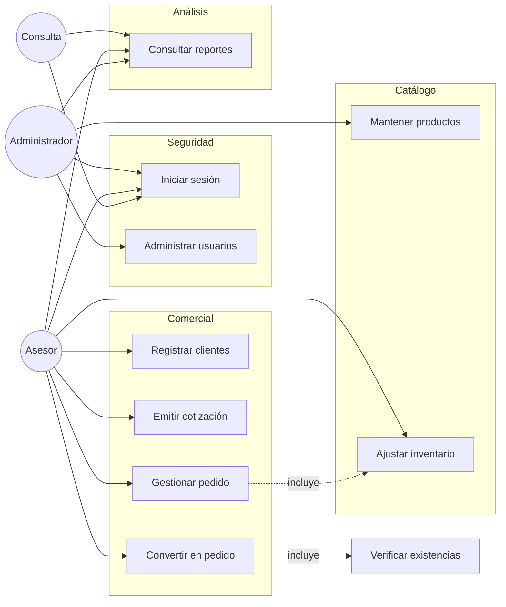
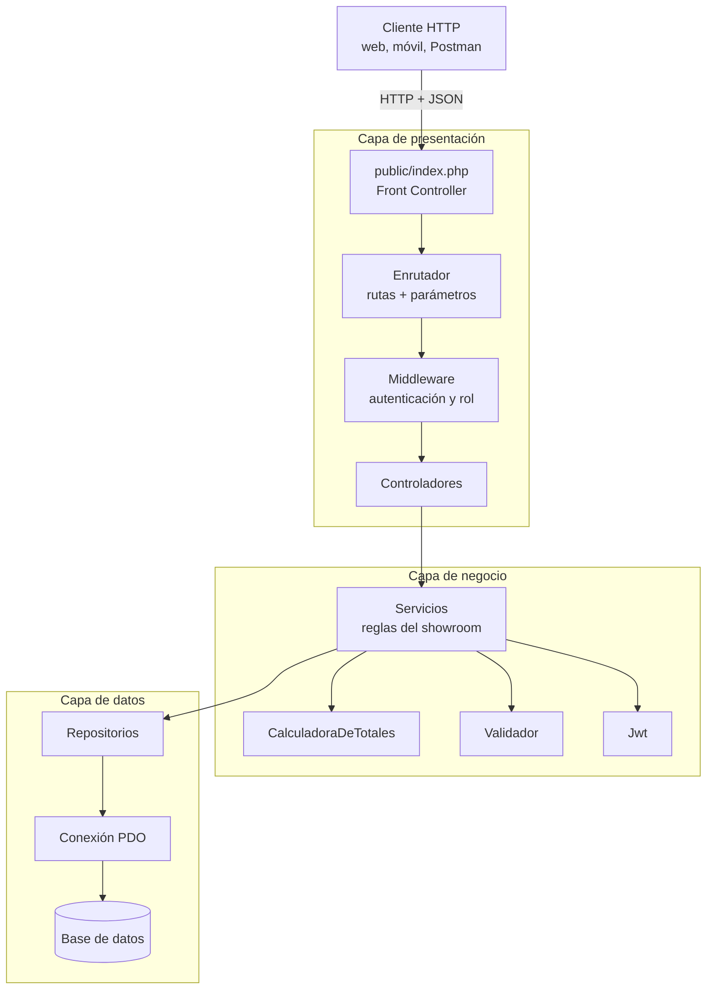
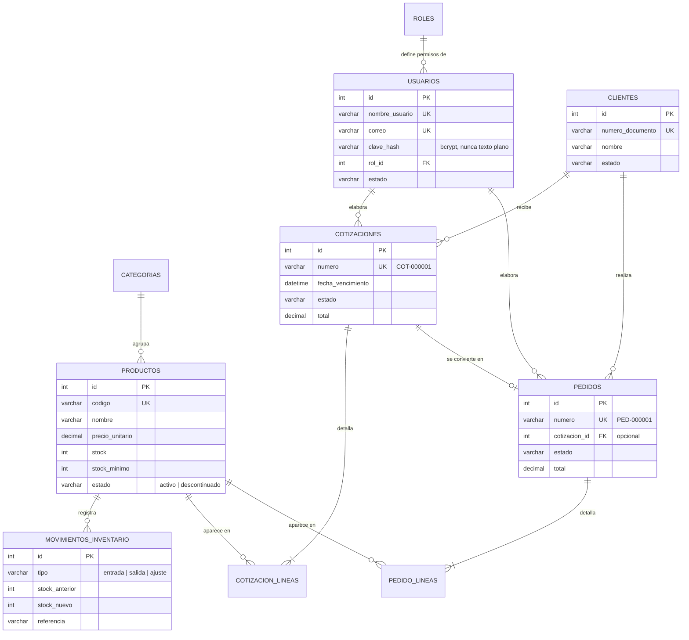
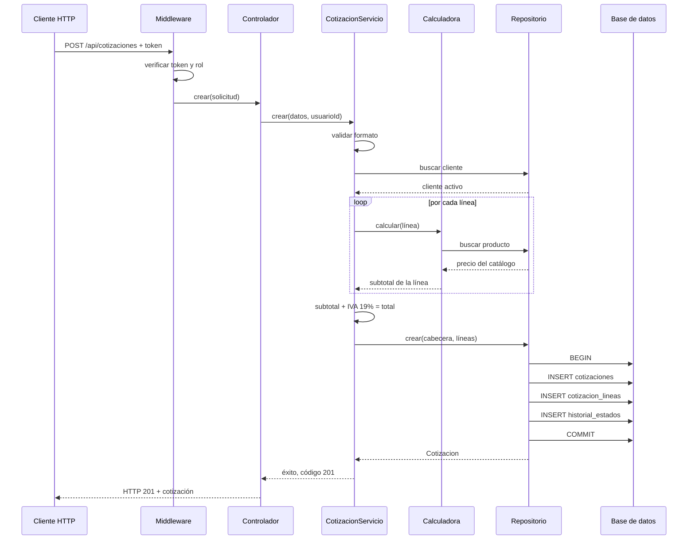
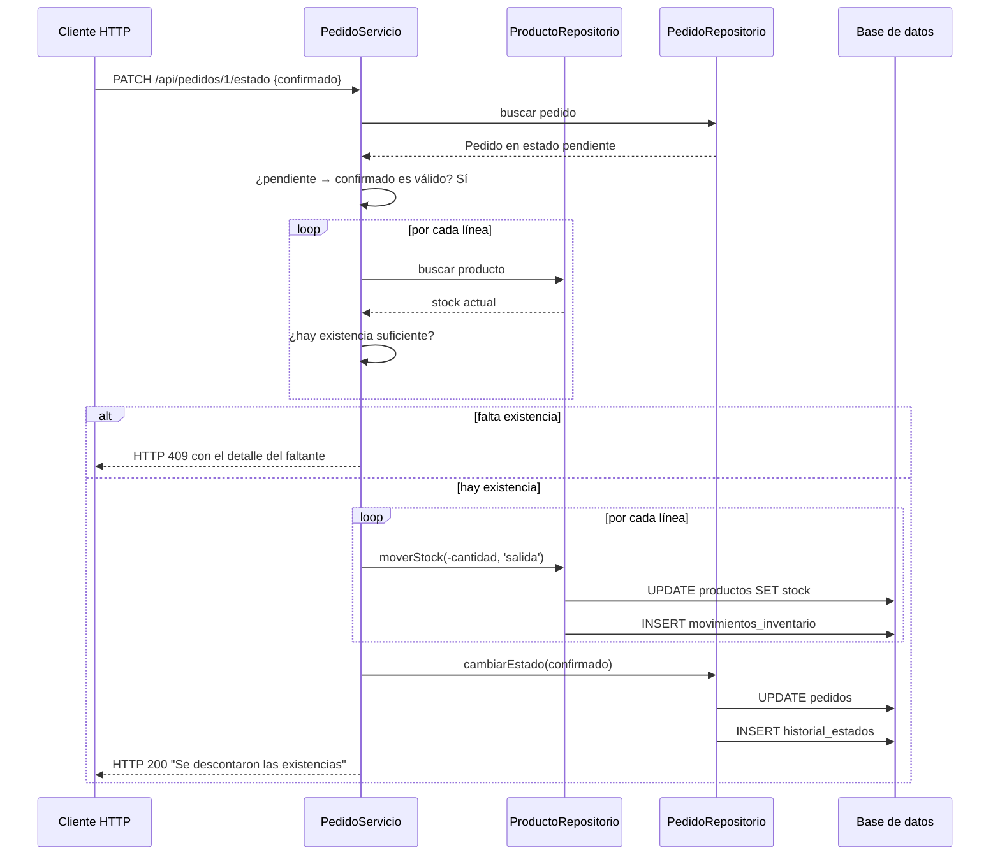
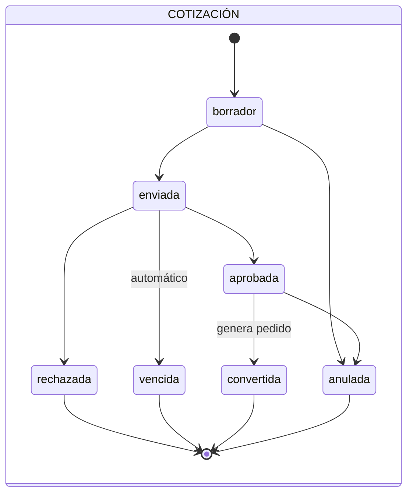
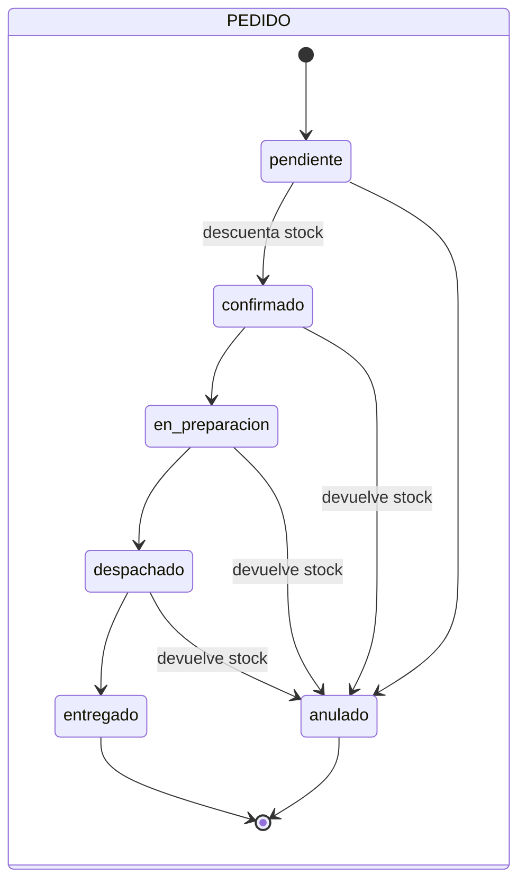

# Diseño del sistema

**Evidencia GA7-220501096-AA5-EV03 — Diseño y desarrollo de servicios web (proyecto)**
Sistema de Showroom y Ventas · API REST

---

## 1. El proyecto formativo

El software administra la operación comercial de un **showroom de muebles**: el
catálogo que se exhibe, los clientes que lo visitan, las cotizaciones que se les
entregan y los pedidos en que algunas de esas cotizaciones se convierten.

El sistema se construye como una **API REST**, de modo que la misma lógica pueda
consumirse después desde una aplicación web, una aplicación móvil para los
asesores en sala, o un panel administrativo.

Esta evidencia parte del servicio de autenticación desarrollado en
**GA7-220501096-AA5-EV01** y lo amplía hasta un sistema completo.

---

## 2. Requisitos

### 2.1. Requisitos funcionales

| ID | Requisito | Prioridad |
|---|---|---|
| RF-01 | Autenticar usuarios y emitir un token de sesión. | Alta |
| RF-02 | Diferenciar permisos por rol: administrador, asesor y consulta. | Alta |
| RF-03 | Administrar cuentas de usuario. | Media |
| RF-04 | Mantener un catálogo de productos organizado por categorías. | Alta |
| RF-05 | Controlar las existencias de cada producto con trazabilidad. | Alta |
| RF-06 | Alertar sobre productos que llegaron a su nivel mínimo. | Media |
| RF-07 | Registrar y consultar clientes. | Alta |
| RF-08 | Emitir cotizaciones con vigencia y cálculo automático de importes. | Alta |
| RF-09 | Controlar el ciclo de vida de las cotizaciones. | Alta |
| RF-10 | Convertir una cotización aprobada en pedido. | Alta |
| RF-11 | Gestionar el ciclo de vida de los pedidos. | Alta |
| RF-12 | Descontar y devolver inventario según el estado del pedido. | Alta |
| RF-13 | Conservar el historial de cambios de estado de cada documento. | Media |
| RF-14 | Generar reportes de ventas, demanda e inventario. | Media |

### 2.2. Requisitos no funcionales

| ID | Requisito |
|---|---|
| RNF-01 | Las contraseñas nunca se almacenan ni se transmiten en texto plano. |
| RNF-02 | Todas las consultas a la base de datos usan sentencias preparadas. |
| RNF-03 | Los importes se calculan en el servidor; nunca se aceptan del cliente. |
| RNF-04 | Las respuestas siguen siempre la misma estructura JSON. |
| RNF-05 | Los códigos de estado HTTP corresponden al resultado real. |
| RNF-06 | Ningún endpoint queda desprotegido: el permiso se declara junto a la ruta. |
| RNF-07 | El código está comentado y organizado en capas. |
| RNF-08 | El proyecto se gestiona con control de versiones. |
| RNF-09 | El sistema se ejecuta sin instalar dependencias externas. |

---

## 3. Actores y casos de uso

### 3.1. Actores

| Actor | Descripción |
|---|---|
| **Administrador** | Configura el sistema: usuarios, catálogo y parámetros. |
| **Asesor comercial** | Atiende al cliente en sala: cotiza, vende y hace seguimiento. |
| **Usuario de consulta** | Revisa información sin modificarla (gerencia, contabilidad). |

### 3.2. Diagrama de casos de uso



### 3.3. Caso de uso CU-06: Emitir cotización

| Elemento | Descripción |
|---|---|
| **Actor principal** | Asesor comercial |
| **Precondición** | El asesor está autenticado; el cliente existe y está activo. |
| **Postcondición** | Existe una cotización en estado `borrador` con sus líneas y totales. |
| **Entrada** | `cliente_id` y una lista de líneas con producto, cantidad y descuento. |
| **Salida** | La cotización creada, con número consecutivo y fecha de vencimiento. |

**Flujo principal**

1. El asesor envía `POST /api/cotizaciones`.
2. El sistema valida el formato de los datos.
3. El sistema verifica que el cliente exista y esté activo.
4. Por cada línea, el sistema busca el producto y **toma su precio del catálogo**.
5. El sistema calcula descuentos, subtotal, IVA y total.
6. El sistema asigna número consecutivo y fecha de vencimiento a 15 días.
7. El sistema guarda cabecera y líneas **en una transacción** y responde `201`.

**Flujos alternativos**

| # | Condición | Respuesta |
|---|---|---|
| 2a | Datos inválidos o sin líneas | `422` con el detalle por campo. |
| 3a | El cliente no existe | `422`. |
| 3b | El cliente está inactivo | `409`. |
| 4a | Un producto no existe o está descontinuado | `422` indicando la línea. |
| 5a | Un descuento supera el máximo permitido | `422`. |
| 7a | Falla la persistencia | Se revierte la transacción y se responde `500`. |

### 3.4. Caso de uso CU-07: Convertir cotización en pedido

**Flujo principal**

1. El asesor envía `POST /api/cotizaciones/{id}/convertir-pedido`.
2. El sistema verifica que la cotización esté **aprobada**.
3. El sistema verifica que no haya generado ya un pedido.
4. El sistema **recalcula exigiendo existencias** de cada producto.
5. El sistema crea el pedido conservando los importes que el cliente aprobó.
6. El sistema marca la cotización como `convertida` y responde `201`.

**Flujos alternativos**

| # | Condición | Respuesta |
|---|---|---|
| 2a | La cotización no está aprobada | `409` indicando el estado actual. |
| 3a | Ya existe un pedido de esa cotización | `409`. |
| 4a | Existencias insuficientes | `409` detallando qué falta y cuánto hay. |

---

## 4. Arquitectura

### 4.1. Diagrama de componentes



### 4.2. Responsabilidad de cada capa

| Capa | Responsabilidad | Lo que **no** hace |
|---|---|---|
| Presentación | Recibir la petición, comprobar permisos, devolver JSON. | No aplica reglas de negocio ni escribe SQL. |
| Negocio | Decidir si una operación es válida y qué efectos tiene. | No conoce HTTP ni SQL. |
| Datos | Ejecutar consultas preparadas y mapear filas a modelos. | No decide reglas. |

**Ventaja práctica:** la lógica de cotizar es la misma se invoque desde la API,
desde un script de consola o desde una futura aplicación de escritorio.

### 4.3. Estructura de carpetas

```
sistema-showroom-api/
├── config/config.php              Configuración y reglas de negocio
├── database/esquema_mysql.sql     DDL para MySQL
├── docs/                          Esta documentación
├── postman/                       Colección de pruebas
├── public/                        Única carpeta expuesta
│   ├── index.php                  Front Controller y tabla de rutas
│   └── cliente/                   Cliente web de demostración
├── scripts/                       Pruebas, datos de ejemplo, arranque
└── src/
    ├── arranque.php               Autoloader PSR-4 e inyección de dependencias
    ├── Nucleo/                    Solicitud, Respuesta, Enrutador, Contexto
    ├── Middleware/                Autenticación y autorización por rol
    ├── BaseDatos/                 Conexión PDO y migraciones
    ├── Modelos/                   Entidades del dominio
    ├── Repositorios/              Acceso a datos (todo el SQL)
    ├── Servicios/                 Reglas de negocio
    ├── Validacion/                Validación de entradas
    └── Controladores/             Traducción HTTP ↔ negocio
```

---

## 5. Modelo de datos

### 5.1. Diagrama entidad–relación



### 5.2. Tres decisiones del modelo

**Los totales se guardan calculados en la cabecera.** Podría parecer redundante
—se pueden sumar las líneas—, pero un documento emitido es histórico: si mañana
cambia el precio de un producto, la cotización que el cliente ya recibió no debe
alterarse.

**El precio se copia en cada línea.** Por la misma razón. La línea no apunta al
precio actual del producto, sino que guarda el que tenía al cotizar.

**Existe `movimientos_inventario` además de la columna `stock`.** No basta con
saber cuántas unidades hay: hay que poder explicar por qué. Cada movimiento
registra el antes, el después, el motivo y el documento que lo causó.

---

## 6. Diagramas de secuencia

### 6.1. Crear una cotización



### 6.2. Confirmar un pedido y descontar inventario



### 6.3. Máquina de estados de los documentos





---

## 7. Reglas de negocio

| # | Regla | Dónde se hace cumplir |
|---|---|---|
| RN-01 | El IVA es del 19 % y se aplica sobre el subtotal ya descontado. | `CalculadoraDeTotales` |
| RN-02 | Los precios se toman del catálogo, nunca del cliente. | `CalculadoraDeTotales` |
| RN-03 | Una cotización vence a los 15 días de emitida. | `CotizacionServicio` |
| RN-04 | Un asesor no puede aplicar más del 20 % de descuento. | `Validador` |
| RN-05 | Solo una cotización aprobada se convierte en pedido. | `CotizacionServicio` |
| RN-06 | Una cotización no se convierte dos veces. | `CotizacionServicio` |
| RN-07 | Confirmar un pedido descuenta inventario; anularlo lo devuelve. | `PedidoServicio` |
| RN-08 | El inventario nunca queda en negativo. | `ProductoRepositorio` |
| RN-09 | Los documentos siguen una máquina de estados. | Modelos `Cotizacion` y `Pedido` |
| RN-10 | No se emiten documentos a clientes inactivos. | `CotizacionServicio`, `PedidoServicio` |
| RN-11 | No se cotizan productos descontinuados. | `CalculadoraDeTotales` |
| RN-12 | Productos y clientes se dan de baja lógicamente, no se borran. | Servicios y repositorios |
| RN-13 | Un administrador no puede desactivarse a sí mismo. | `AutenticacionServicio` |
| RN-14 | Cada cambio de estado queda en bitácora con autor y fecha. | `RepositorioBase` |

---

## 8. Diseño de la seguridad

### 8.1. Autenticación y autorización

```
Petición ──► ¿tiene token? ──No──► 401
                 │ Sí
                 ▼
            ¿firma válida y no expirado? ──No──► 401
                 │ Sí
                 ▼
            ¿la cuenta sigue activa? ──No──► 403
                 │ Sí
                 ▼
            ¿el rol basta para esta ruta? ──No──► 403
                 │ Sí
                 ▼
              Controlador
```

> **Por qué se recarga el usuario desde la base de datos** y no se confía solo
> en el token: si una cuenta se desactiva después de emitir el token, el acceso
> debe cortarse de inmediato, sin esperar a que el token expire.

### 8.2. Permisos por rol

| Operación | Administrador | Asesor | Consulta |
|---|:---:|:---:|:---:|
| Consultar catálogo, clientes y documentos | ✔ | ✔ | ✔ |
| Consultar reportes | ✔ | ✔ | ✔ |
| Crear clientes, cotizaciones y pedidos | ✔ | ✔ | — |
| Ajustar inventario | ✔ | ✔ | — |
| Crear y editar productos y categorías | ✔ | — | — |
| Administrar usuarios y roles | ✔ | — | — |

---

## 9. Glosario

| Término | Definición |
|---|---|
| **API REST** | Estilo de servicio web donde cada recurso tiene una URL y se opera con verbos HTTP. |
| **Cotización** | Propuesta económica con vigencia limitada, sin compromiso de entrega. |
| **Pedido** | Venta en firme que compromete existencias. |
| **Kardex** | Registro histórico de los movimientos de un producto. |
| **JWT** | Token firmado que transporta la identidad y el rol del usuario. |
| **Middleware** | Comprobación que se ejecuta antes del controlador. |
| **Máquina de estados** | Conjunto de estados y transiciones válidas de un documento. |
| **Baja lógica** | Marcar un registro como inactivo en lugar de borrarlo. |
| **Transacción** | Conjunto de operaciones que se aplican todas o ninguna. |
