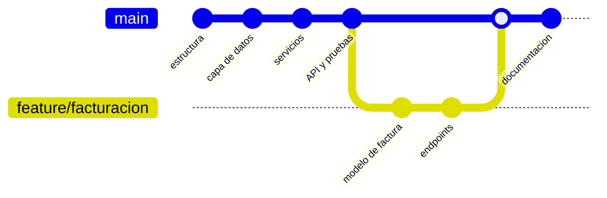

# Control de versiones del proyecto

**Evidencia GA7-220501096-AA5-EV03**

> Requisito del enunciado: *"Se debe crear el proyecto utilizando herramientas de
> versionamiento"* y *"Archivo con enlace del repositorio"*.

---

## 1. Herramienta utilizada

**Git**, sistema de control de versiones distribuido. Es el estándar de la
industria y el que utilizan GitHub, GitLab y Bitbucket.

```bash
git --version
```

## 2. Inicialización

```bash
cd sistema-showroom-api
git init -b main
```

## 3. Archivos excluidos del versionamiento

`.gitignore` impide subir lo que **no debe** quedar en el repositorio:

| Patrón | Motivo |
|---|---|
| `.env` | Contiene credenciales reales y la clave secreta del JWT. |
| `almacenamiento/*.sqlite` | Base de datos generada en ejecución; cada desarrollador tiene la suya. |
| `*.log` | Registros locales sin valor para el repositorio. |
| `/vendor/` | Dependencias reinstalables. |
| `.vscode/`, `.idea/`, `Thumbs.db` | Archivos del editor y del sistema operativo. |

> **Buena práctica aplicada.** Sí se versiona `.env.example`, una plantilla
> **sin datos reales**, para que cualquiera sepa qué variables configurar. Subir
> un `.env` con credenciales es uno de los errores de seguridad más frecuentes.

## 4. Convención de mensajes

Se aplicó **Conventional Commits**:

```
<tipo>(<alcance>): <descripción breve en imperativo>

<cuerpo con el detalle y el porqué de las decisiones>
```

| Tipo | Uso |
|---|---|
| `feat` | Nueva funcionalidad. |
| `fix` | Corrección de un defecto. |
| `docs` | Documentación. |
| `test` | Pruebas. |
| `chore` | Configuración y mantenimiento. |

**Ventaja:** el historial se lee como la bitácora del proyecto. En este
repositorio los mensajes explican además **por qué** se tomó cada decisión, no
solo qué se cambió.

---

## 5. Historial de commits

El orden reproduce la **construcción por capas**: primero la infraestructura,
luego el acceso a datos, después la lógica de negocio, la interfaz HTTP, las
pruebas y por último la documentación.

| # | Hash | Mensaje |
|---|---|---|
| 1 | `8136802` | `chore: estructura inicial del proyecto y configuracion` |
| 2 | `756fa6c` | `feat(nucleo): enrutador con parametros de ruta, middleware y contexto` |
| 3 | `43c1d85` | `feat(datos): conexion PDO y esquema de once tablas` |
| 4 | `d06ea24` | `feat(modelos): entidades del dominio y maquina de estados` |
| 5 | `809ab7b` | `feat(datos): repositorios con consultas preparadas y transacciones` |
| 6 | `56b8a71` | `feat(validacion): validador de todas las entidades del dominio` |
| 7 | `d181cbf` | `feat(seguridad): JWT con rol y middleware de autenticacion` |
| 8 | `bbcf8ea` | `feat(auth): autenticacion y administracion de usuarios` |
| 9 | `f06326c` | `feat(catalogo): catalogo, inventario con trazabilidad y clientes` |
| 10 | `7de5579` | `feat(comercial): cotizaciones, pedidos y efecto sobre el inventario` |
| 11 | `df6586d` | `feat(reportes): ventas, demanda de productos y reposicion` |
| 12 | `d87c670` | `feat(api): controladores, arranque y tabla de 37 rutas` |
| 13 | `b791054` | `feat(cliente): cliente web de demostracion del flujo comercial` |
| 14 | `b841df3` | `test: bateria de pruebas automatizadas y datos de ejemplo` |
| 15 | `7a4c9d9` | `test(postman): coleccion de 47 peticiones con 87 aserciones` |
| 16 | `f551413` | `docs: diseno del sistema, documentacion de servicios y plan de pruebas` |

Consultas útiles:

```bash
git log --oneline
git log --oneline --stat        # archivos afectados por cada commit
git show 7de5579                # el detalle de un cambio concreto
```

---

## 6. Publicación en GitHub

### Paso 1 — Crear el repositorio

En **github.com** → botón **New repository**:

- **Nombre:** `sistema-showroom-api`
- **Visibilidad:** Public (para que el instructor pueda abrirlo sin permisos)
- **No marcar** «Add a README file», «Add .gitignore» ni «Choose a license»:
  el proyecto ya los trae y crearlos generaría un conflicto.

### Paso 2 — Enlazar y subir

```bash
cd sistema-showroom-api
git remote add origin https://github.com/USUARIO/sistema-showroom-api.git
git push -u origin main
```

Sustituya `USUARIO` por su nombre de usuario de GitHub.

### Paso 3 — Verificar

```bash
git remote -v
git log origin/main --oneline
```

En el navegador deben verse los 16 commits y el README en la portada.

> **Si GitHub pide contraseña:** desde 2021 no acepta la contraseña de la cuenta.
> Hay que generar un *token* en **Settings → Developer settings → Personal access
> tokens → Tokens (classic)**, con el permiso `repo`, y usarlo como contraseña.

### Paso 4 — Registrar el enlace

Escribir la URL del repositorio en el archivo `ENLACE-REPOSITORIO.txt` que
acompaña esta entrega.

---

## 7. Flujo de trabajo para continuar el proyecto



```bash
git checkout -b feature/facturacion   # crear la rama de trabajo
# ... desarrollo y pruebas ...
git add .
git commit -m "feat(facturacion): emision de factura desde pedido entregado"
git checkout main
git merge feature/facturacion         # integrar
git branch -d feature/facturacion     # eliminar la rama ya integrada
```

**Por qué ramas:** `main` se mantiene siempre en un estado funcional y
desplegable, mientras el trabajo en curso queda aislado hasta estar probado.

---

## 8. Comandos empleados

| Comando | Función |
|---|---|
| `git init -b main` | Crea el repositorio con la rama principal `main`. |
| `git status` | Muestra los archivos modificados y pendientes. |
| `git add <ruta>` | Agrega cambios al área de preparación. |
| `git commit -m "..."` | Registra los cambios preparados. |
| `git log --oneline` | Historial resumido. |
| `git show <hash>` | Detalle de un commit. |
| `git diff` | Diferencias aún no preparadas. |
| `git checkout -b <rama>` | Crea una rama y se posiciona en ella. |
| `git merge <rama>` | Integra una rama en la actual. |
| `git remote add origin <url>` | Enlaza con el repositorio remoto. |
| `git push -u origin main` | Publica la rama en el remoto. |

---

## 9. Evidencia del cumplimiento

| Criterio del enunciado | Evidencia |
|---|---|
| El proyecto se creó con herramientas de versionamiento | Repositorio Git con 16 commits (sección 5). |
| Historial ordenado y trazable | Conventional Commits, con el porqué de cada decisión (sección 4). |
| Información sensible protegida | `.gitignore` excluye `.env` y la base de datos local (sección 3). |
| Proyecto reproducible por terceros | `.env.example`, `README.md`, datos de ejemplo y scripts de arranque versionados. |
| Archivo con enlace del repositorio | `ENLACE-REPOSITORIO.txt` (sección 6, paso 4). |
