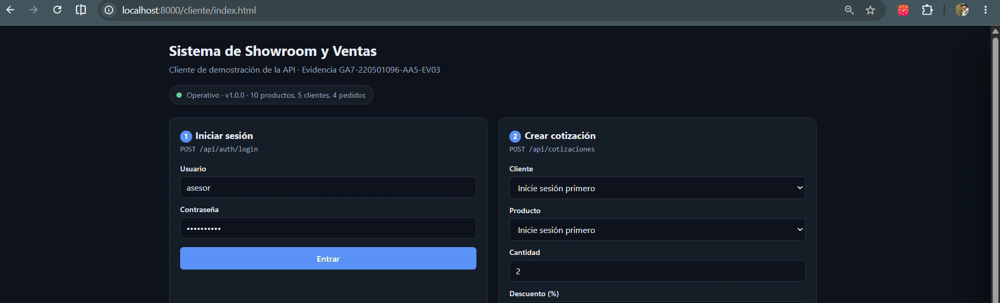
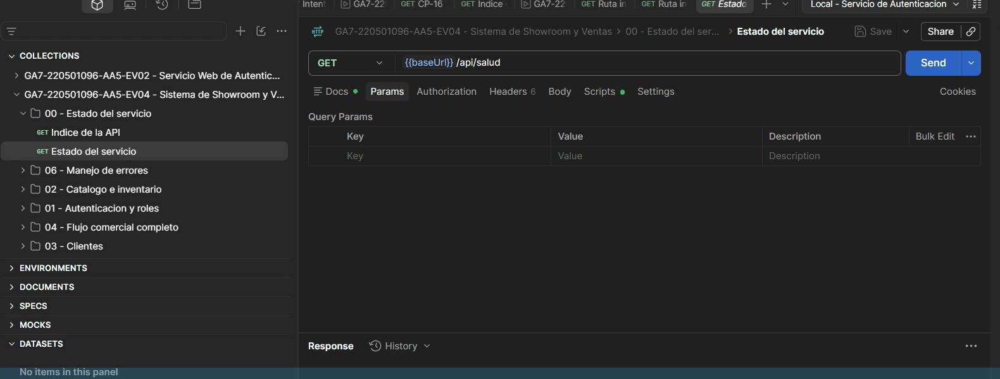
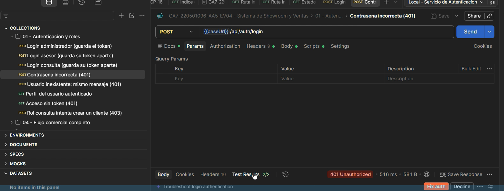
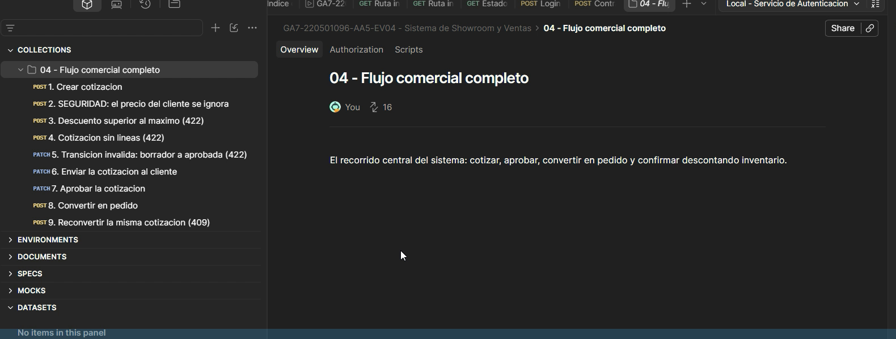
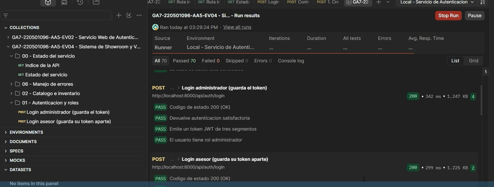
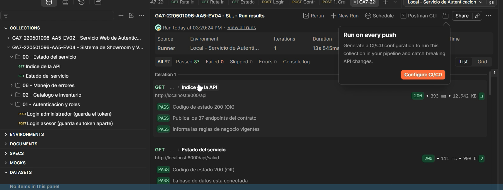

# Documento de pruebas de la API

**Evidencia GA7-220501096-AA5-EV04 — API del proyecto**
Sistema de Showroom y Ventas · Testing con Postman

> Esta evidencia toma como base la API desarrollada en
> **GA7-220501096-AA5-EV03** y documenta su testing con la herramienta Postman.

---

## 1. Objetivo

Verificar mediante **Postman** que los 37 servicios de la API cumplen su
contrato: que responden con los códigos de estado correctos, que las reglas de
negocio del showroom se hacen cumplir, y que los controles de seguridad
funcionan incluso cuando el cliente intenta saltárselos.

---

## 2. Alcance del testing

| Carpeta de la colección | Qué verifica | Peticiones |
|---|---|---|
| 00 — Estado del servicio | Disponibilidad y publicación del contrato. | 2 |
| 01 — Autenticación y roles | Login de los tres roles, credenciales inválidas, permisos. | 8 |
| 02 — Catálogo e inventario | Consulta, creación, duplicados y ajuste de existencias. | 9 |
| 03 — Clientes | Registro, duplicados y validaciones. | 4 |
| 04 — Flujo comercial completo | Cotización → aprobación → pedido → inventario. | 16 |
| 05 — Reportes | Ventas, demanda de productos y reposición. | 4 |
| 06 — Manejo de errores | Códigos 404, 405 e inyección SQL. | 4 |
| **Total** | | **47** |

Las 47 peticiones ejecutan **87 aserciones automáticas** escritas en la pestaña
`Tests` de cada una.

---

## 3. Entorno de pruebas

| Elemento | Valor |
|---|---|
| Herramienta | Postman (aplicación de escritorio) |
| Sistema operativo | Windows 11 |
| Servicio | API REST en PHP 8.1, `http://localhost:8000` |
| Base de datos | SQLite (se crea sola al arrancar) |
| Entorno de Postman | `Local - Servicio de Autenticación` |

### Preparación

```bash
php scripts/sembrar-datos.php
php -S localhost:8000 -t public public/index.php
```

Luego, en Postman: **Import** → arrastrar los dos archivos de la carpeta
`postman/` → seleccionar el entorno *Local*.

> **La colección se puede ejecutar cuantas veces se quiera.** Dos peticiones
> tienen un *script previo* que genera un código de producto y un número de
> documento únicos a partir de la marca de tiempo. Sin eso, la segunda
> ejecución fallaría con `409` por duplicado.

---

## 4. El sistema bajo prueba



*Figura 1. Cliente web de demostración del Sistema de Showroom y Ventas. Recorre
el flujo comercial completo: inicio de sesión, creación de la cotización, ciclo
del documento y confirmación del pedido con descuento de inventario.*



*Figura 2. Colección importada en Postman, con sus siete carpetas. A la derecha,
la petición `GET {{baseUrl}}/api/salud` de la carpeta «00 - Estado del servicio».*

---

## 5. Casos de prueba ejecutados

### 5.1. Autenticación y roles

| ID | Caso | Esperado | Resultado |
|---|---|---|---|
| CP-01 | Login de administrador | `200` + token JWT con rol | ✅ |
| CP-02 | Login de asesor | `200` + rol `asesor` | ✅ |
| CP-03 | Login de consulta | `200` | ✅ |
| CP-04 | **Contraseña incorrecta** | `401` «Error en la autenticación» | ✅ |
| CP-05 | Usuario inexistente | `401` con **mensaje idéntico** al de CP-04 | ✅ |
| CP-06 | Perfil del usuario autenticado | `200` | ✅ |
| CP-07 | Acceso sin token | `401` | ✅ |
| CP-08 | Rol `consulta` intenta crear un cliente | `403` indicando el rol requerido | ✅ |



*Figura 3. CP-04: `POST /api/auth/login` con contraseña incorrecta devuelve
`401 Unauthorized`. La pestaña «Test Results 2/2» confirma que las dos
aserciones de la petición pasaron.*

> **Por qué CP-05 comparte mensaje con CP-04.** Si el servicio respondiera «ese
> usuario no existe», un atacante podría ir descubriendo qué cuentas están
> registradas. Se llama enumeración de usuarios, y el mensaje uniforme la
> impide. Hay una aserción dedicada a comprobarlo.

### 5.2. Catálogo e inventario

| ID | Caso | Esperado | Resultado |
|---|---|---|---|
| CP-09 | Listar categorías | `200` | ✅ |
| CP-10 | Listar catálogo paginado | `200` + objeto de paginación | ✅ |
| CP-11 | Búsqueda por texto libre | `200` | ✅ |
| CP-12 | Consultar producto con su kardex | `200` + movimientos de inventario | ✅ |
| CP-13 | Crear producto | `201` con el stock inicial registrado | ✅ |
| CP-14 | Código de producto duplicado | `409` | ✅ |
| CP-15 | Precio negativo | `422` señalando el campo | ✅ |
| CP-16 | Ajustar stock (+5) | `200`, de 10 a 15 unidades | ✅ |
| CP-17 | Ajuste que dejaría el stock negativo | `409` | ✅ |

### 5.3. Clientes

| ID | Caso | Esperado | Resultado |
|---|---|---|---|
| CP-18 | Listar clientes | `200` | ✅ |
| CP-19 | Registrar cliente | `201` | ✅ |
| CP-20 | Documento duplicado | `409` | ✅ |
| CP-21 | Correo con formato inválido | `422` señalando el campo | ✅ |

### 5.4. Flujo comercial completo

Es el recorrido central del sistema y la parte más importante del testing.



*Figura 4. Carpeta «04 - Flujo comercial completo» con sus peticiones en orden:
crear la cotización, comprobar los controles de seguridad, recorrer el ciclo de
estados, convertirla en pedido y verificar el efecto sobre el inventario.*

| ID | Caso | Esperado | Resultado |
|---|---|---|---|
| CP-22 | Crear cotización | `201`, estado `borrador`, número `COT-000001` | ✅ |
| CP-23 | **El IVA es el 19 % del subtotal** | Comprobado por aserción aritmética | ✅ |
| CP-24 | Vigencia de la cotización | 15 días | ✅ |
| CP-25 | **Seguridad: el cliente envía `precio_unitario: 1`** | Se ignora; se usa el precio del catálogo | ✅ |
| CP-26 | Descuento del 50 %, superior al máximo del 20 % | `422` | ✅ |
| CP-27 | Cotización sin líneas | `422` | ✅ |
| CP-28 | Saltar de `borrador` a `aprobada` | `422`, transición inválida | ✅ |
| CP-29 | `borrador` → `enviada` | `200` | ✅ |
| CP-30 | `enviada` → `aprobada` | `200`, ya admite conversión | ✅ |
| CP-31 | Convertir en pedido | `201`, número `PED-000001` | ✅ |
| CP-32 | El pedido conserva el total aprobado | Igual al de la cotización | ✅ |
| CP-33 | Reconvertir la misma cotización | `409` | ✅ |
| CP-34 | Stock antes de confirmar | Guardado en variable | ✅ |
| CP-35 | **Confirmar el pedido descuenta 2 unidades** | Stock = anterior − 2 | ✅ |
| CP-36 | **Anular el pedido devuelve el inventario** | Stock vuelve al valor original | ✅ |
| CP-37 | Un pedido anulado ya no admite cambios | `409` | ✅ |
| CP-38 | El pedido conserva su historial de estados | Más de 2 registros | ✅ |

> **CP-25 es la prueba de seguridad más importante del sistema.** La petición
> envía a propósito `"precio_unitario": 1` y `"subtotal": 1`. La aserción
> comprueba que el subtotal devuelto sea **mayor que 1**, es decir, que el
> servidor ignoró lo que mandó el cliente y usó el precio real del catálogo.
> Sin esta regla, cualquiera podría comprar un sofá por un peso.

### 5.5. Reportes

| ID | Caso | Esperado | Resultado |
|---|---|---|---|
| CP-39 | Reporte de ventas del mes | `200` con resumen y desglose por estado | ✅ |
| CP-40 | Rango de fechas invertido | `422` | ✅ |
| CP-41 | Productos más cotizados | `200` | ✅ |
| CP-42 | Inventario bajo mínimos | `200` | ✅ |

### 5.6. Manejo de errores y seguridad

| ID | Caso | Esperado | Resultado |
|---|---|---|---|
| CP-43 | Ruta inexistente | `404` **en JSON**, no como página de PHP | ✅ |
| CP-44 | Método no permitido (`GET` sobre `/api/auth/login`) | `405` indicando el método correcto | ✅ |
| CP-45 | Recurso inexistente (`/api/productos/999999`) | `404` | ✅ |
| CP-46 | **Inyección SQL en el login** (`admin' OR '1'='1`) | `401`, sin filtrar errores del motor | ✅ |

---

## 6. Ejecución completa con el Collection Runner



*Figura 5. Ejecución en curso. Se ven las aserciones de las peticiones de login:
código `200`, «Devuelve autenticación satisfactoria», «Emite un token JWT de tres
segmentos» y «El usuario tiene rol administrador». Abajo, la petición de
contraseña incorrecta devolviendo `401` con su aserción en verde.*



*Figura 6. Resultado final: **All 87 · Passed 87 · Failed 0 · Skipped 0 ·
Errors 0**, en 13,5 segundos. Las primeras peticiones confirman que la API
publica los 37 endpoints del contrato y que la base de datos está conectada.*

---

## 7. Verificación por línea de comandos

La misma colección se ejecutó con **Newman**, el corredor de Postman para
consola, que permite dejar constancia del resultado en texto:

```
┌─────────────────────────┬───────────────────┬───────────────────┐
│                         │          executed │            failed │
├─────────────────────────┼───────────────────┼───────────────────┤
│              iterations │                 1 │                 0 │
├─────────────────────────┼───────────────────┼───────────────────┤
│                requests │                47 │                 0 │
├─────────────────────────┼───────────────────┼───────────────────┤
│            test-scripts │                47 │                 0 │
├─────────────────────────┼───────────────────┼───────────────────┤
│      prerequest-scripts │                 2 │                 0 │
├─────────────────────────┼───────────────────┼───────────────────┤
│              assertions │                87 │                 0 │
├─────────────────────────┴───────────────────┴───────────────────┤
│ total run duration: 5.6s                                        │
├─────────────────────────────────────────────────────────────────┤
│ average response time: 51ms [min: 23ms, max: 152ms]             │
└─────────────────────────────────────────────────────────────────┘
```

La salida detallada, petición por petición, está en
`postman/resultado-ejecucion-newman.txt`.

---

## 8. Pruebas automatizadas del código

De forma complementaria al testing con Postman, el proyecto incluye una batería
de pruebas que se ejecuta sin servidor, sobre una base de datos temporal:

```bash
php scripts/pruebas.php
```

**36 casos de prueba · 46 verificaciones · 0 fallos.** El detalle está en
`docs/03-plan-de-pruebas.md`.

Las dos baterías se complementan: Postman verifica el **contrato HTTP** (rutas,
códigos de estado, permisos por rol), y las pruebas del código verifican las
**reglas de negocio** desde dentro, incluidas las que no son visibles desde
fuera.

---

## 9. Conclusión

El testing con Postman confirma que los 37 servicios de la API cumplen el
contrato documentado en `docs/ENDPOINTS.md`. Las **87 aserciones automáticas**
pasaron sin un solo fallo.

Lo verificado se agrupa en tres niveles:

**Funcional.** El ciclo comercial completo —cotizar, enviar, aprobar, convertir
en pedido, confirmar y anular— funciona de extremo a extremo, y el inventario
cuadra en cada paso: baja al confirmar y vuelve a subir al anular.

**De reglas de negocio.** Las transiciones de estado inválidas se rechazan, una
cotización no se convierte dos veces, no se emiten documentos a clientes
inactivos, el descuento máximo se respeta y el stock nunca queda en negativo.

**De seguridad.** Los importes no son manipulables desde el cliente, los
permisos por rol se hacen cumplir con código `403`, el mensaje de error del
login no revela qué cuentas existen, y la inyección SQL se trata como texto
literal sin filtrar errores del motor de base de datos.

No se registraron fallos en la ejecución.
